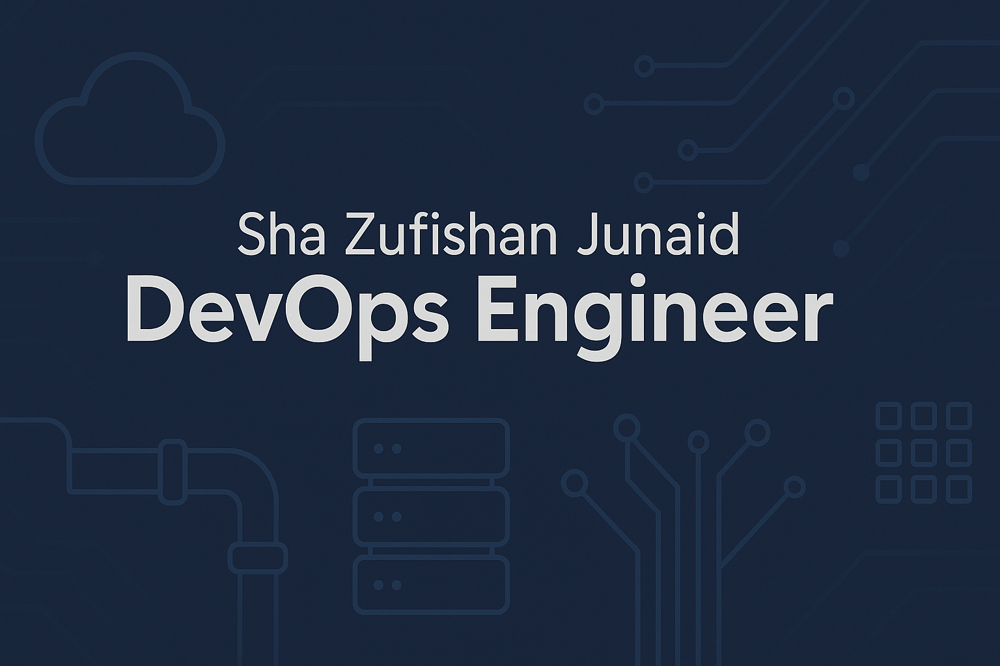

<!-- Banner -->

# Hi there 👋, I'm Junaid

*Entry-level DevOps Engineer | Terraform · Docker · CI/CD · Learning AWS & GitOps*

---

## 🔎 About Me
Hi, I’m Junaid 👋 — a DevOps Engineer starting my journey in automation and cloud infrastructure.  
I enjoy working with **Terraform, Docker, and CI/CD pipelines**, and I’m learning **AWS** and **GitOps** to grow further in the field.

- 🚀 Passionate about building reliable and automated systems  
- 🐧 Comfortable with Linux, Git, Shell scripting, and Python basics  
- 🎯 Interested in scalable deployments and modern cloud-native practices  
- 📚 Always learning — currently deepening my AWS and Kubernetes knowledge  

---

## 🔝 Featured Projects

### [EKS Cluster Provisioning with Worker Nodes](https://github.com/junaid-13/EKS-cluster-provisioning-with-worker-nodes)
Infrastructure-as-Code setup to provision an AWS EKS cluster with worker nodes using Terraform.  
⚡ Demonstrates Kubernetes on AWS, Terraform modules, and cloud infrastructure provisioning.  

---

### [Multi-Environment AWS IaC](https://github.com/junaid-13/Multi-Environment-AWS-IAC)
Terraform configurations for managing multiple AWS environments (dev, staging, prod).  
💡 Highlights environment isolation, reusable IaC patterns, and AWS resource provisioning.  

---

### [Infra-Live (In Progress)](https://github.com/junaid-13/infra-live)
A work-in-progress project exploring advanced Terraform infrastructure setups.  
🚧 Currently under development — included to reflect my ongoing learning and practice in building production-like IaC systems.  

---

## 🛠 Tech Stack

**Infrastructure as Code**  

**Cloud & Orchestration**  

**CI/CD & Automation**  

**Languages & Databases**  

**Operating Systems & VCS**  

**Currently Exploring**  

---

## 📊 GitHub Stats & Activity

  

---

## 🏆 GitHub Achievements

---

## ✉️ Contact
- LinkedIn: [linkedin.com/in/yourprofile](https://linkedin.com/in/sha-zufishan-junaid)  
- GitHub: [https://github.com](https://github.com/junaid-13)
